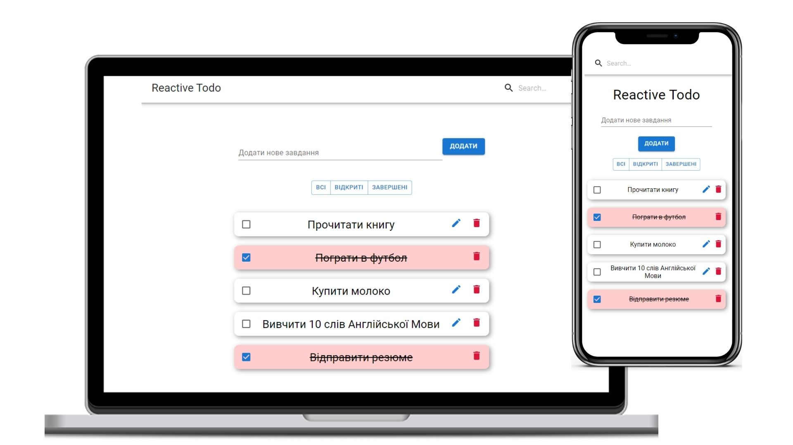

# [Reactive Todo](https://dkazarov.github.io/React_Todo/)

Technologies: React v16.8
Hooks: UseState, UseEffect, USeRef

Libraries: [nanoid](https://www.npmjs.com/package/nanoid)
Functional:

- Add tasks
- Delete tasks
- Change tasks
- Search todo
- Change status todo
- Save your todo to Local Storage
